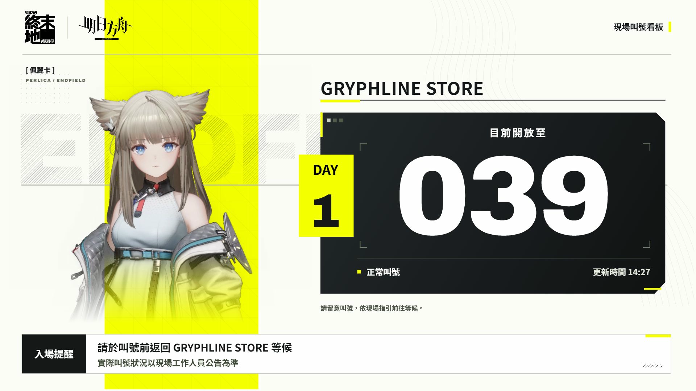
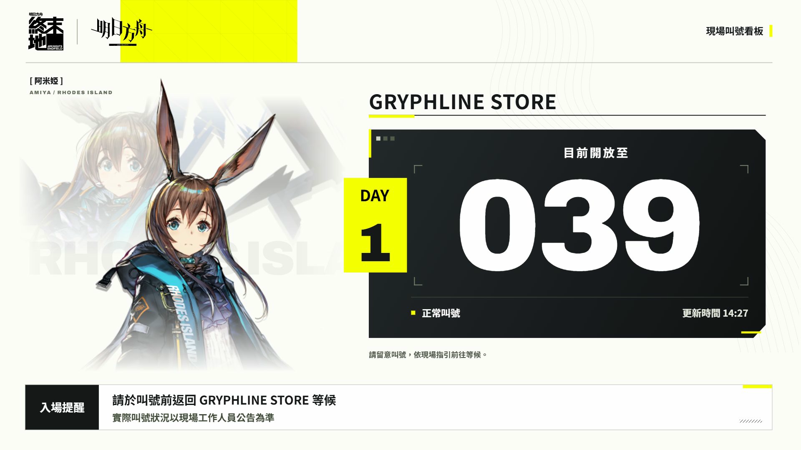
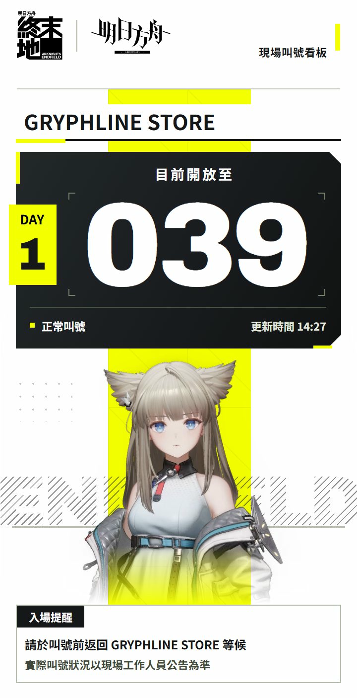
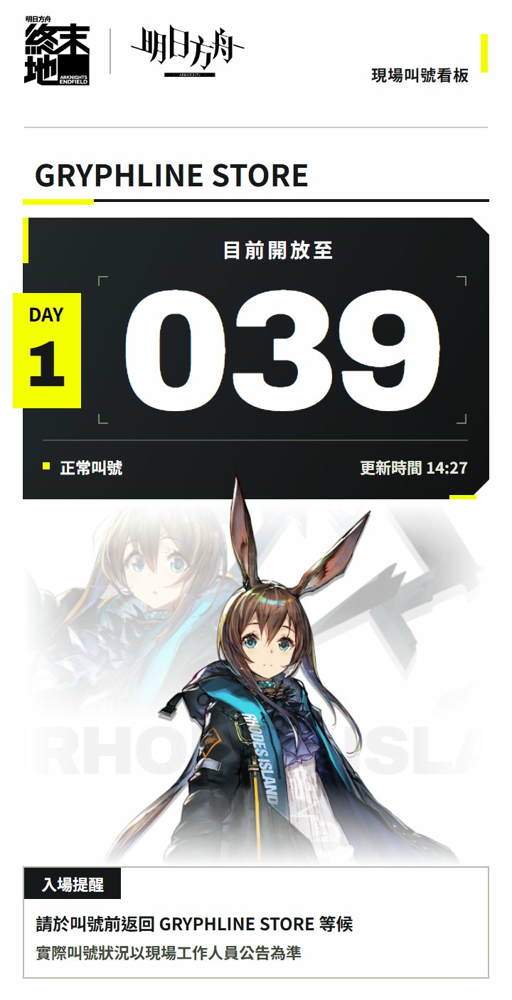

# 已確認 V6 示意與交接

請下一個 AI **先讀 [HANDOFF.md](../HANDOFF.md)**。使用者已確認 V6，正式網站尚未改版，下一步是移植版型與優化素材載入。

## 最新示意（請勿沿用 V1–V5）

| 電腦：佩麗卡 | 電腦：阿米婭 |
|---|---|
|  |  |

| 手機：佩麗卡 | 手機：阿米婭 |
|---|---|
|  |  |

四張圖為 JPG 封裝於 SVG 的完整截圖，非向量人物素材。如 GitHub 不顯示，下載 SVG 後以瀏覽器開啟。

## 重建

在倉庫根目錄執行：

```powershell
powershell -ExecutionPolicy Bypass -File handoff-v6/restore.ps1
node preview.cjs 8080
```

需要 Node.js、npm、Edge 與網路。官方素材由 restore.ps1 重新取得；本資料夾保留 V6 完整 CSS、生成/擷取/渲染腳本、來源及檢查記錄。網站入口仍為原版本。

給下一個 AI 的訊息：

> 請接手此倉庫，先讀 HANDOFF.md、README.md、SOURCES.md 與 handoff-v6/README.md。使用者已確認 V6 示意；請以其為準，不要恢復阿米婭黑色色塊。先核對最新版示意和目前程式，再接續正式網站改版及素材載入優化。交接中的圖片微動態只是預覽，不代表正式效能優化已完成。
